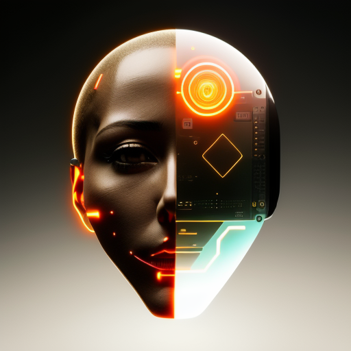

<h1 align="center"><big>fail4</big></h1>

> This project is built to fail  
> (until it doesn't)  
> Restart until it works

# Prompt-Driven WebUI for Creative Development

Discover a web-based user interface designed for prompt-driven development, enabling users to create
a wide array of digital art including games, visual effects, fractal art, and flow fields. This
platform emphasizes prompt-driven creativity, inspiring users to push their artistic limits.

Featuring an interactive development environment, the WebUI allows for seamless real-time
visualization of your artistic creations. Delve into limitless possibilities and unleash your
imagination with the Prompt-Driven WebUI for Creative Development.

## Features

- 100% prompt-driven for enhanced creativity
- Supports various types of digital art, including games, visual effects, fractal art, and flow
  fields
- Built-in code editor for a seamless development experience
- Real-time visualization of your creations
- Supports GPT-3.5 Turbo and GPT-4 models
- Adjustable options for temperature and max tokens
- Easy-to-use interface with prompt and negative prompt fields
- Reload and clear prompt functionalities
- Save and manage multiple projects

## Examples

Here are just a few examples of the types of projects you can create:

1. Prompt: Create a mesmerizing, swirling vortex pattern that evolves over time.
2. Prompt: Design a firework display that launches and explodes at random locations and intervals.
3. Prompt: Generate a calming, flowing water simulation with waves and ripples.
4. Prompt: Create a dynamic solar system simulation with planets orbiting at different speeds.
5. Prompt: Design a captivating, ever-changing kaleidoscope pattern.
6. Prompt: Build a particle-based physics simulation where particles interact with each other and
   the environment.
7. Prompt: Design a fluid art simulator that creates unique, flowing patterns on the canvas.
8. Prompt: Create a bouncing ball simulation with different ball sizes, elasticity, and gravity
   settings.
9. Prompt: Design an interactive, generative art piece that evolves and grows over time, creating an
   organic visual experience.
10. Prompt: Create a simulation of a flock of birds flying together, showcasing realistic flocking
    behavior and interactions.

## Getting Started

To get started with the Prompt-Driven WebUI for Creative Development, simply follow these steps:

1. Clone the repository to your local machine.
2. Copy the `.env.local.example` file to a new file named `.env.local` and add your `OPENAI_API_KEY`
   from the OpenAI platform (platform.openai.com).
3. Install the required dependencies using `npm install`.
4. Run the development server with `npm run dev` to access the WebUI.
5. Begin creating your own digital art!

Happy creating!
